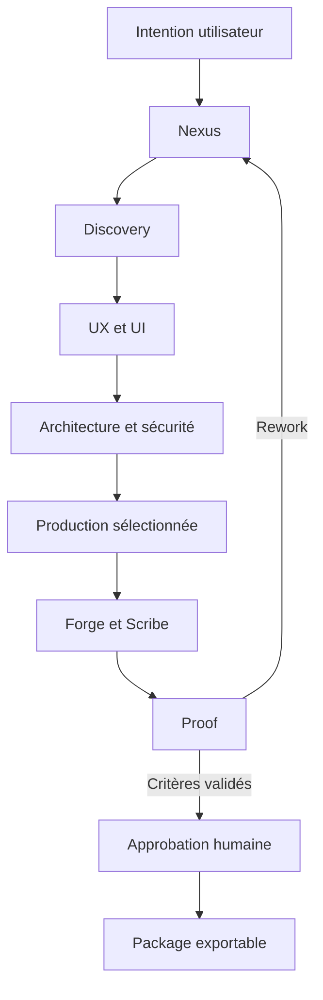
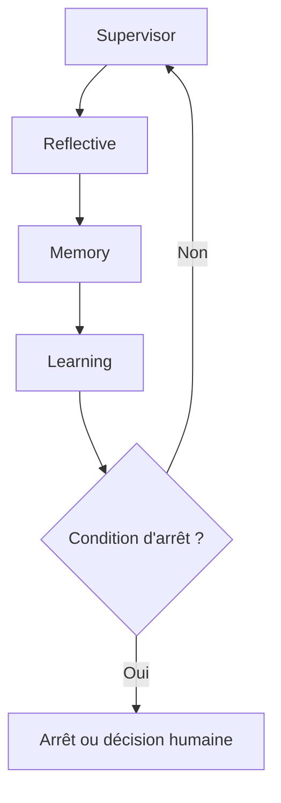

# ELMAN-OS — Architecture v0.4.0 alpha 7

**Organisation :** ELMAN Technologies  
**Produit :** ELMAN-OS  
**Livrable :** Foundation Kit v0.4.0 alpha 7, runtime IA auditable  
**Statut :** socle local exécutable, non prêt pour la production

## 1. Vision

ELMAN-OS est le système d’exploitation du cycle de création logicielle : il
cadre, planifie, produit, vérifie et apprend sous contrôle humain. Il ne remplace
pas Windows, Linux, macOS, Android ou iOS.

La promesse architecturale est :

> Transformer une intention en projet exportable dont les exigences, décisions,
> preuves, corrections et risques sont traçables.

## 2. Invariants

1. Nexus ouvre le pipeline et Proof le ferme.
2. Un auteur ne valide pas seul son propre travail.
3. Les quatre agents métacognitifs supervisent sans produire le produit.
4. Les critères d’acceptation précèdent le code.
5. Toute boucle est bornée par itérations, coût, temps et progrès.
6. Les actions sensibles exigent une approbation humaine indépendante.
7. La mémoire ne conserve pas de secret brut.
8. Le kernel reste Python ; les autres langages sont isolés par couche.
9. Une proposition d’apprentissage n’est jamais activée automatiquement.
10. Un résultat non exécuté n’est pas déclaré vérifié.

## 3. Registre des agents

### Chaîne de production

| N° | Agent | Mandat principal |
|---:|---|---|
| 0 | ELMAN Nexus | Orchestration, contrat, routage, budget et approbations |
| 1 | ELMAN Discovery | Produit, MVP, exigences et critères |
| 2 | ELMAN Experience | UX, parcours et architecture de l’information |
| 3 | ELMAN Canvas | UI, design system et responsive |
| 4 | ELMAN Atlas | Architecture, ADR, dépendances et rollback |
| 5 | ELMAN Gateway | API, schémas, versions et contrats clients |
| 6 | ELMAN Core | Backend et logique métier |
| 7 | ELMAN Data | Schémas, migrations, sauvegarde et rétention |
| 8 | ELMAN Web | Interface web et tests navigateur |
| 9 | ELMAN Mobile | Android, iOS, permissions et hors ligne |
| 10 | ELMAN Connect | Paiements, notifications, IA et services tiers |
| 11 | ELMAN Shield | Sécurité, identité, secrets et vie privée |
| 12 | ELMAN Inclusive | Accessibilité, internationalisation et contenu |
| 13 | ELMAN Velocity | Performance, capacité et coût |
| 14 | ELMAN Forge | Intégration, builds, CI/CD et packaging |
| 15 | ELMAN Scribe | Documentation, ADR et notes de version |
| 16 | ELMAN Proof | Vérification finale indépendante |

### Couche métacognitive interne

| Agent | Entrées | Sorties | Interdit |
|---|---|---|---|
| Supervisor | progression, coût, temps, risque | continuer, corriger, arrêter, escalader | coder, déployer |
| Reflective | intention, action, résultat | écart et correction ciblée | corriger le produit |
| Memory | faits, décisions, épisodes | mémoire sourcée et expirable | secret brut, fait inventé |
| Learning | succès vérifiés | proposition ou expérience | auto-modification |

Le standard professionnel commun est défini dans `catalog.system_prompt()` :
méthode équivalente à 15+ années, preuves, analyse des risques, résultat
réversible, confiance explicite et handoff.

## 4. Topologie

La couche métacognitive observe chaque cycle :

## 5. Planification

`planning.py` transforme un `ProjectIntent` validé en `ExecutionPlan`.

Types pris en charge :

- `saas` : web obligatoire ;
- `mobile` : Android ou iOS obligatoire ;
- `fullstack` : web et au moins une plateforme mobile.

Le plan est déterministe, inspectable et ne contacte pas de modèle. Les
spécialistes sont sélectionnés selon les plateformes et fonctions. Connect est
ajouté pour paiements, notifications, webhooks ou IA.

Les étapes de cadrage, expérience, architecture et vérification possèdent des
portes humaines explicites.

## 6. Boucle métacognitive

Chaque cycle suit :

1. Frame ;
2. Map ;
3. Model ;
4. Decide ;
5. Act ;
6. Verify ;
7. Reflect ;
8. Correct ;
9. Learn.

Valeurs par défaut :

| Limite | Valeur |
|---|---:|
| Itérations | 5 |
| Même échec | 2 |
| Cycles sans progrès | 2 |
| Coût abstrait | 100 |
| Durée | 3 600 secondes |

Décisions d’arrêt :

| Événement | Statut |
|---|---|
| Proof PASS + critères validés | `ready_for_human_approval` |
| Itérations, coût ou durée | `stopped_limit` |
| Finding critique | `blocked` |
| Décision/permission manquante | `blocked` |
| Échec répété ou stagnation | `blocked` |

## 7. Approbations humaines

`approvals.py` impose les gates pour :

- déploiement production ;
- publication store ;
- service payant ;
- données réelles ;
- secret ;
- migration destructive ;
- suppression ;
- message externe ;
- activation d’une leçon.

Le demandeur ne peut pas approuver sa propre demande. Une approbation couvre
une action précise et est persistée dans SQLite.

## 8. Mémoire et persistance

### Mémoire métacognitive

- travail : durée du workflow ;
- épisodique : cycles et preuves ;
- sémantique : leçons validées par un humain.

Les clés ressemblant à des mots de passe, jetons ou secrets sont masquées avant
stockage.

### SQLite Kernel Store

`persistence.py` stocke :

- rapport complet du workflow ;
- statut et raison d’arrêt ;
- demandes et décisions d’approbation.

SQLite est le choix du MVP local car il est inclus dans Python. Le contrat est
séparé afin de permettre un adaptateur PostgreSQL ultérieur.

## 9. Génération

`generator.py` produit un starter déterministe dans un workspace résolu :

- manifeste `elman.project.json` ;
- projet Python installable ;
- domaine et repository SQLite ;
- API FastAPI optionnelle ;
- mobile Flet optionnel ;
- tests de domaine ;
- critères Proof en attente.

Le générateur refuse :

- chemin absolu ;
- traversal `../` ;
- source spécialisée hors couche autorisée.

Le starter n’est pas déclaré prêt pour la production. Proof doit encore
exécuter les critères du produit réel.

## 10. Politique technologique

| Couche | Langage obligatoire ou préféré | Alternatives bornées |
|---|---|---|
| Kernel, agents, métacognition | Python | aucune |
| Control API | Python/FastAPI | aucune par défaut |
| Web | Python/Flet | JS/TS et frameworks web approuvés |
| Mobile | Python/Flet | TS, Dart, Kotlin, Swift, Java |
| Extension native | Python | Rust/C/C++ isolés |
| Données | Python | SQL dans migrations/données |
| Plateforme | Python | PowerShell/shell dans scripts dédiés |

`technology_policy.py` contrôle les frontières. Les autres langages sont
autorisés pour leur adéquation technique, pas comme remplacement du kernel.

## 11. Plugins internes

| Plugin | Permission | Fonction |
|---|---|---|
| `elman.project_inspector` | `read_workspace` | liste et lit des fichiers bornés |
| `elman.acceptance_checklist` | aucune | compare critères attendus et validés |
| `elman.technology_auditor` | `read_workspace` | audite les frontières de langages |
| `elman.blueprint_validator` | aucune | valide le contrat d’un produit |

Tout plugin est refusé si une permission requise manque.

## 12. API de contrôle

`api.py` fournit un adaptateur FastAPI optionnel :

- santé ;
- registre des agents ;
- création d’un plan ;
- génération d’un starter.

FastAPI n’est pas une dépendance obligatoire du kernel. L’extra `[api]` doit
être installé avant le démarrage du serveur.

## 12.1 Contrat fournisseur IA

`provider.py` sépare désormais le Kernel des SDK de modèles :

- `AIProvider` définit `descriptor`, `generate()` et `close()` ;
- `ModelRequest` borne modèle, messages, tokens, température et délai ;
- `ModelResponse` conserve texte, terminaison, usage et identifiants ;
- `ProviderError` normalise les défaillances et leur caractère retentable ;
- `DeterministicModelProvider` vérifie le contrat sans réseau ni coût.

`openai_compatible.py` implémente l'adaptateur OpenAI/compatible avec un
transport injecté. Le registre peut construire le transport standard ou un
double hors réseau. Cette alpha valide le protocole, pas un service distant.

## 12.2 Authentification et audit IA

`audit.py` enveloppe l'exécuteur résilient :

- un principal déjà vérifié par la frontière applicative est obligatoire ;
- le rôle `ai.execute` et un motif contrôlé sont exigés avant l'appel ;
- principal, tenant et requête sont remplacés par des empreintes HMAC ;
- chaque événement signe son contenu et la signature précédente ;
- prompts, réponses, secrets et métadonnées libres sont absents du schéma ;
- l'échec de l'événement initial bloque l'appel fournisseur.

Le Kernel livre un sink mémoire et un sink JSONL local durable. La validation
JWT/OIDC, la rotation des clés, l'ancrage externe et un backend multi-instance
sont des portes de production ultérieures.

## 13. Sécurité

Contrôles présents :

- deny-by-default pour plugins ;
- confinement des chemins ;
- séparation auteur/vérificateur ;
- gates humaines par action ;
- redaction de secrets ;
- politique de langages ;
- limites de boucle ;
- absence de shell dans le générateur ;
- aucune connexion réseau implicite.

Contrôles encore nécessaires avant production :

- sandbox de processus ou conteneur ;
- allowlist de commandes et réseau ;
- signature des plugins ;
- secrets via références opaques ;
- identité, RBAC et multi-tenant ;
- chiffrement et politiques de rétention ;
- SAST, SCA et scan d’images ;
- journal append-only signé.

## 14. Feuille de route

| Version | Jalon |
|---|---|
| v0.3 | Kernel MVP local, SQLite, approbations et starter |
| v0.4 | Provider IA, sandbox d’exécution et Git workspace |
| v0.5 | ELMAN Studio et événements temps réel |
| v0.6 | Factory SaaS et parcours Proof complet |
| v0.7 | Factory mobile et builds Android/iOS |
| v0.8 | Multi-tenant, observabilité et politiques entreprise |
| v1.0 | Pilote contrôlé avec critères de production |

## 15. Limites de la preuve v0.3

La suite locale prouve le kernel, les frontières, la génération déterministe,
SQLite et les approbations. Elle ne prouve pas :

- la qualité d’un modèle IA réel ;
- l’isolation d’un code hostile ;
- PostgreSQL ou la haute disponibilité ;
- les builds Android/iOS ;
- un déploiement cloud ;
- la conformité réglementaire d’un produit client.
